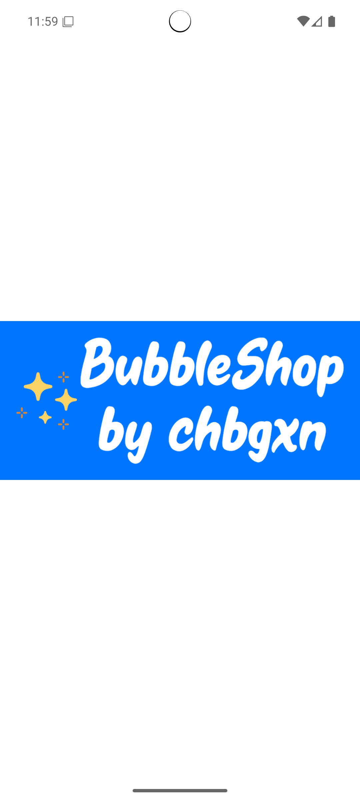
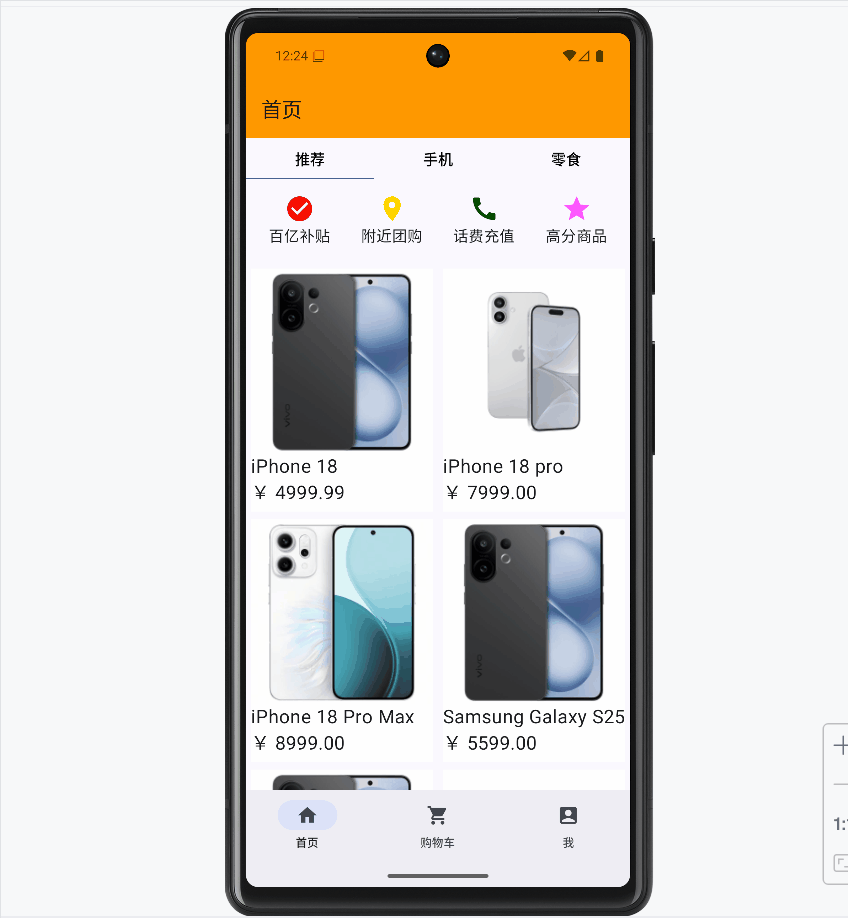
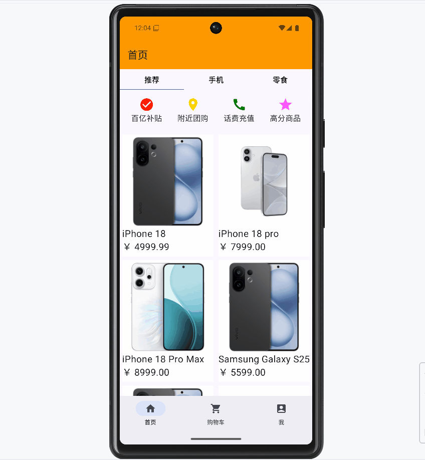
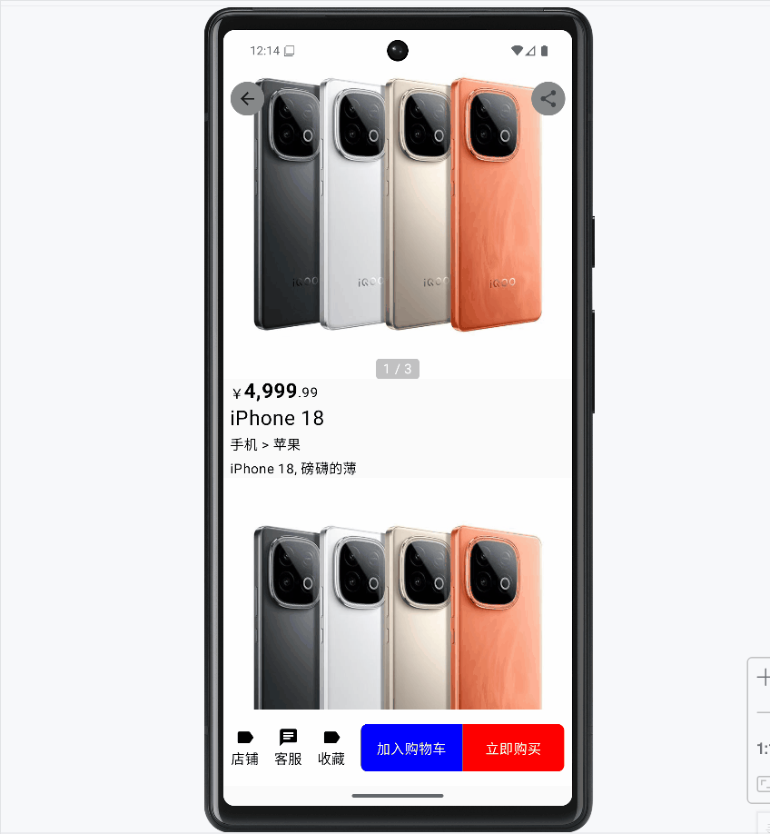
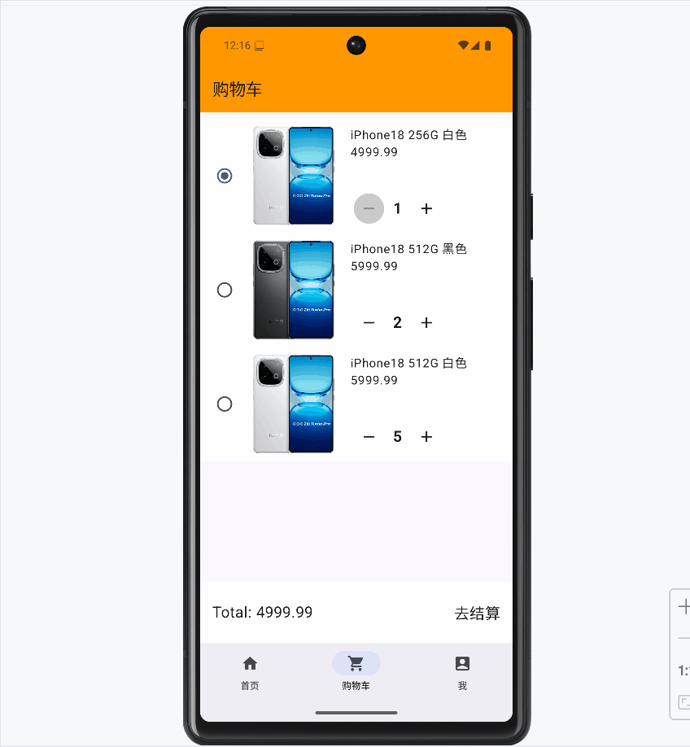
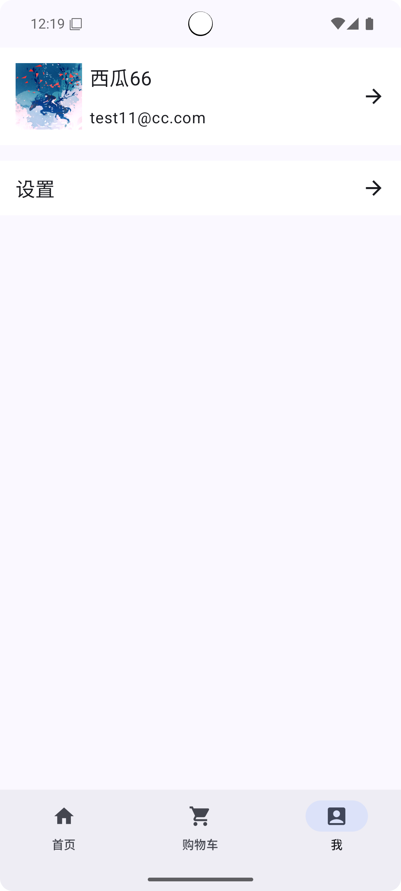
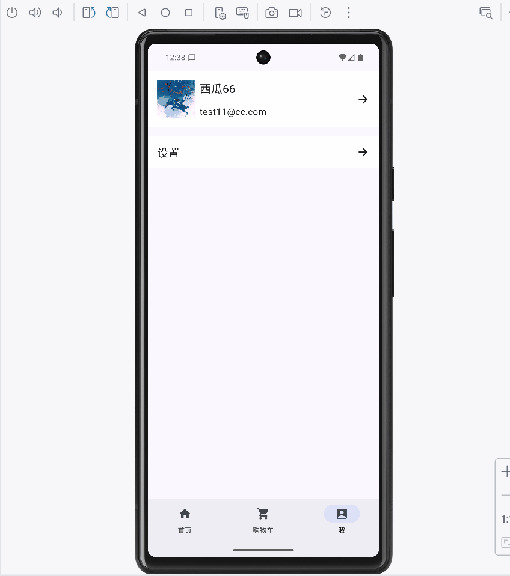
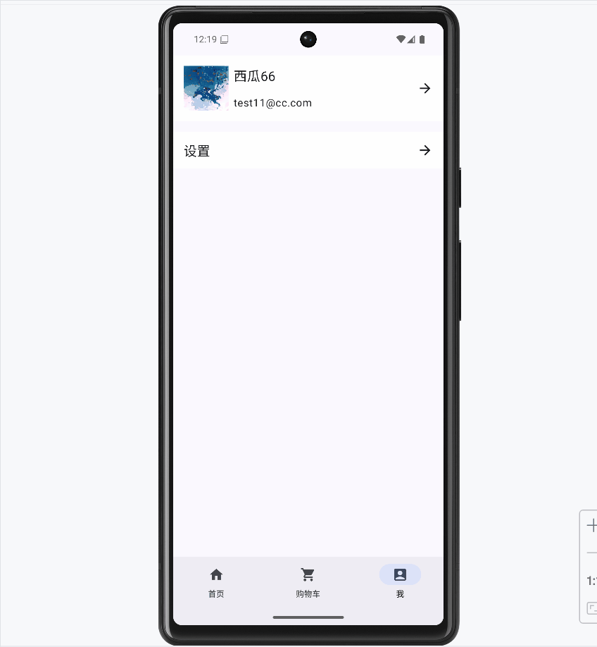
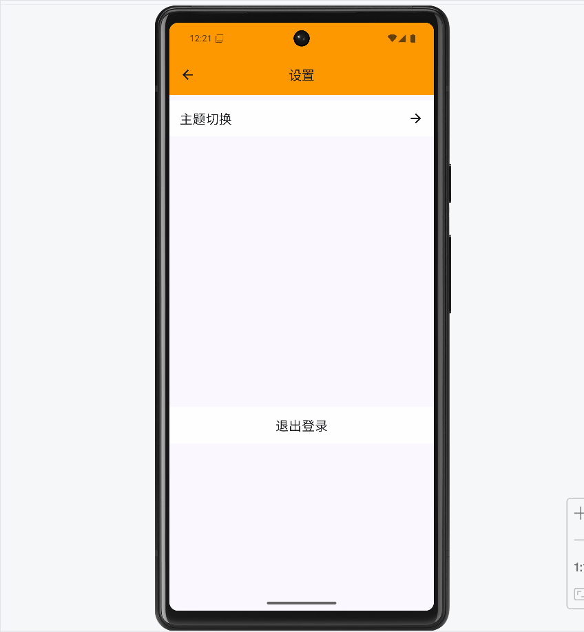

# Bubble Shop

基于 **Jetpack Compose** 的电商项目，配套自建后端，演示移动端与服务端的端到端实现。

## 🧱 技术栈

### 🤖 Android

| 模块      | 描述                            |
|---------|-------------------------------|
| UI      | Jetpack Compose               |
| 网络      | Retrofit + OkHttp             |
| DI      | Hilt                          |
| 架构      | 分层架构，模块解耦，关注可复用、可测试和可维护性      |
| 状态管理    | 模块间事件和状态隔离，确保业务逻辑与 UI 分离      |
| 轻量级全局依赖 | 全局依赖管理模块，用于提供共享资源和通用服务        |

### ☕ Backend

| 模块  | 技术                          |
|:----|-----------------------------|
| 框架  | Spring Boot + JPA           |
| 认证  | JWT                         |
| 数据库 | MySQL（自建，本地部署）              |
| API | RESTful 接口，提供商品、用户、购物车等数据服务 |

## 🎯 开发目标

验证 Compose 架构在中大型项目中的可维护性与扩展性，探索前后端一体化开发流程与性能边界。

项目不聚焦业务完整性，而专注于 **Android 技术栈的深度实践**。

## 🧩 功能

* 认证
  * 登录与退出登录
  * 路由拦截
* 首页瀑布流商品展示
  * 懒加载
  * **分页**加载数据
* 商品详情页
  * 通过滚动监听实现沉浸式渐变导航栏
  * 商品 Banner 无限循环滑动
  * Banner 图片点击全屏预览
  * 支持加入购物车
* 购物车模块（展示）
* 权限获取
* 用户信息展示页
  * 主题模式切换

## 📱 截图预览

|    页面     |                                     截图                                      |
|:---------:|:---------------------------------------------------------------------------:|
|    开屏     |                |
| 登录 + 路由拦截 |                  |
|    首页     |                    |
|   商品详情    |        |
|   加入购物车   |    |
| 购物车展示与更新  |                    |
|   个人界面    |                        |
|  相册权限获取   |        |
| 获取相册图片失败  |  |
|   主题切换    |                  |
|   退出登录    |                |

## 🚧 待实现

* 商品搜索
* 购物车模块（数量修改）
* 用户信息展示页（头像剪裁）
